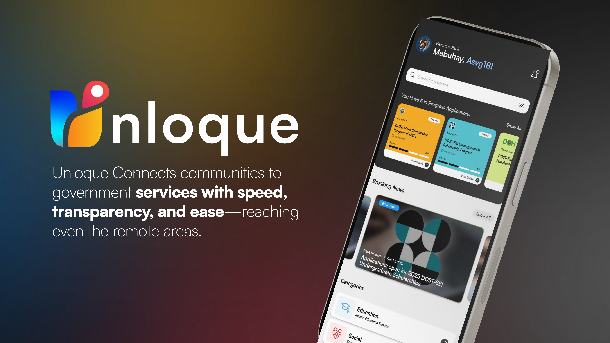
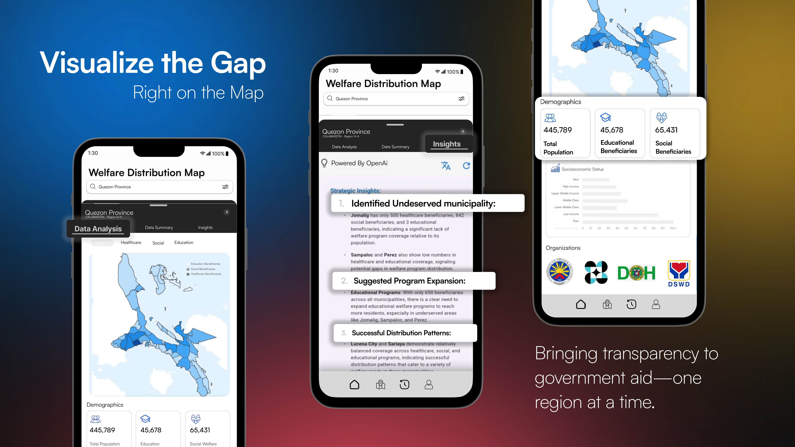
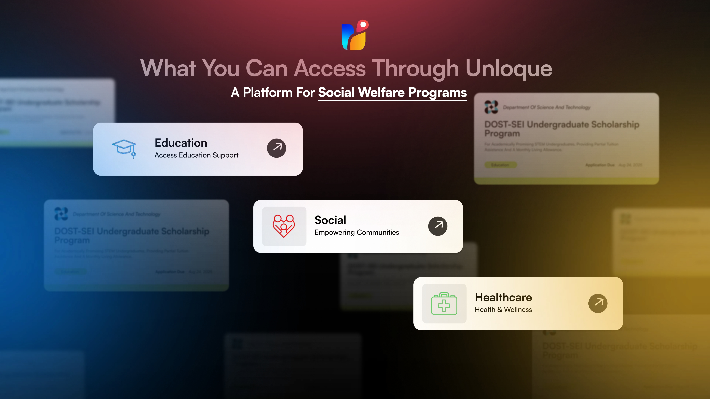
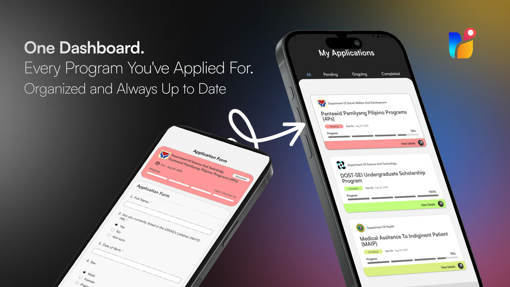

# Unloque






Unloque is a mobile application designed to streamline access to government social welfare programs. It utilizes a map system to visualize population density and the distribution of beneficiaries per program category within Quezon Province. This enables the identification of areas with the greatest need, based on both population and the number of beneficiaries per category and municipality, allowing for targeted resource allocation. This helps improve education and healthcare access while promoting social inclusion.

Filipinos can apply digitally for various programs from agencies like DSWD, DOH, and DOST. While some of the data currently in the system is hypothetical (as it has been manually inputted by the development team), and organizations are only sampled for the app at this stage, the app uses verified data from DSWD, which covers the social welfare category. The DSWD data is the only verified source, while other program categories are still being populated with sample data.

An AI-powered feature compares this data across regions, identifying underserved areas by analyzing population size and the number of beneficiaries for each program category. This ensures resources are allocated efficiently to areas with the greatest need, reducing bias in program targeting.

The map currently includes real-time data on the beneficiaries of programs under social healthcare and education within Quezon Province. This beneficiary data is integrated into the app's data summary and insights module, which generates visual insights and analytical reports on the distribution of aid across municipalities. This enables government agencies to monitor trends, assess program effectiveness, and make informed decisions for future planning.

The user-friendly interface provides a centralized platform for applying to multiple programs, making social welfare services accessible to all Filipinos. Meanwhile, government agencies benefit from a comprehensive interface for processing applications, enabling balanced resource allocation and efficient program delivery.
**Note**: Unloque is currently designed for Android devices and works best on medium-sized phones.

### How to Run the Project

Follow these steps to run the project on your local machine:

1. **Clone the Repository**:
   ```bash
   git clone <repository-url>
   cd unloque
   ```

2. **Install Dependencies**:
   Ensure you have Flutter installed. Then, run:
   ```bash
   flutter pub get
   ```

3. **Run the Application**:
   Connect an Android device or start an emulator, then execute:
   ```bash
   flutter run
   ```

4. **Build for Production**:
   To build the app for release, use:
   ```bash
   flutter build apk
   ```

## Project Structure

The app is being migrated toward a simple “clean-ish” structure to keep UI, state, and data access separated and easier to maintain.
See `docs/ARCHITECTURE.md` for the detailed conventions.

### Folder diagram

```text
lib/
   screens/       UI screens/pages only (Scaffold, routing, layout)
   widgets/       Reusable UI components used by screens
   providers/     State management (ChangeNotifier/ViewModel-style)
   services/      Data access (Firebase/HTTP/local IO); no UI code
   models/        Plain data models
   constants/     App-wide constants (colors, keys, etc.)
   utils/         Small helpers (formatting, parsing, etc.)

assets/
   images/        Image assets
   map/           GeoJSON assets
```

### Conventions

- File names: `snake_case.dart`
- Classes/widgets: `PascalCase`
- Variables/functions: `camelCase`
- Imports: prefer `package:unloque/...` for cross-feature imports

### Where code should live

- `screens/`: build methods, navigation, and composing widgets
- `widgets/`: UI pieces that can be reused across screens
- `providers/`: async loading + UI state; calls into `services/`
- `services/`: Firestore/Storage/Auth, HTTP, and persistence logic

### Resources

A few resources to get you started if this is your first Flutter project:

- [Lab: Write your first Flutter app](https://docs.flutter.dev/get-started/codelab)
- [Cookbook: Useful Flutter samples](https://docs.flutter.dev/cookbook)

For help getting started with Flutter development, view the
[online documentation](https://docs.flutter.dev/), which offers tutorials,
samples, guidance on mobile development, and a full API reference.

## License Notice

This project uses Syncfusion Essential Studio (Maps component) under the Community License.

To build or run this application, users must obtain their own valid Syncfusion Community License:  
https://www.syncfusion.com/products/communitylicense

Syncfusion libraries are **not** included in this repository.

